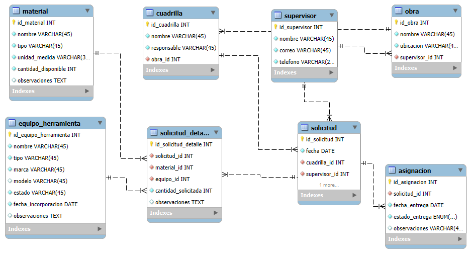

# Base de Datos: Inventario de Herramientas y Materiales – SIECO

Este módulo contiene los archivos necesarios para crear y comprender la base de datos utilizada en el sistema de inventario, desarrollado como un proyecto personal basado en procesos reales de la empresa SIECO.

*Este desarrollo no constituye un software oficial de la empresa.

---

## Contenido de esta carpeta

| Archivo                       | Descripción                                                                      |
|-------------------------------|----------------------------------------------------------------------------------|
| 'sieco_estructura.sql'        | Script completo para crear la base de datos 'sieco' con sus tablas y relaciones. |
| 'modelo_inventario_sieco.png' | Diagrama EER exportado desde MySQL Workbench.                                    |
| 'README_SQL.md'               | Este archivo, con detalles de uso y estructura.                                  |

---

## Estructura general de la base de datos

La base de datos incluye las siguientes tablas:

- 'obra': Registro de obras activas.
- 'cuadrilla': Equipos de trabajo asignados a una obra específica.
- 'equipo_herramienta': Herramientas y equipos disponibles.
- 'material': Materiales almacenados en inventario.
- 'solicitud': Solicitudes hechas por supervisores, con justificación y detalle.
- 'supervisor': Encargados responsables de solicitudes y gestión de cuadrillas.

Todas las relaciones están debidamente establecidas mediante claves foráneas.

---

## Relaciones clave

- Una **cuadrilla** pertenece a una **obra** ('cuadrilla.id_obra → obra.id_obra')
- Una **solicitud** está relacionada con:
  - una **cuadrilla**
  - un **supervisor**
  - un **equipo/herramienta** o un **material**

---

## Cómo utilizar el script

1. Abrir MySQL Workbench.
2. Crear una nueva conexión local.
3. Abrir el archivo `sieco_estructura.sql'.
4. Ejecutar el script completo para crear la base de datos y sus tablas.

---

## Vista del Modelo

---